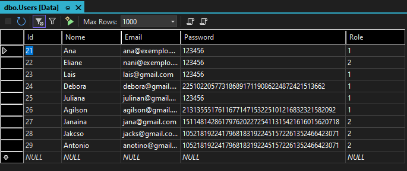
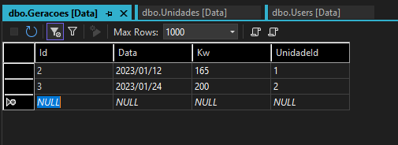

# SolaryEnergia     
<h1 align="center">
    
</h1>
<p align="center">
    PROSHOP é um projeto baseado no curso <a href="https://www.udemy.com/course/mern-ecommerce/">MERN eCommerce from Scratch</a>
</p>
<p align="center">
    
    </p>
    
    <p align="center">
 <a href="#-sobre-o-projeto">Sobre</a> •
 <a href="#-funcionalidades">Funcionalidades</a> •
 <a href="#-layout">Layout</a> • 
 <a href="#-como-executar-o-projeto">Como executar</a> • 
 <a href="#-tecnologias">Tecnologias</a> • 
 <a href="#-autor">Autor</a> • 
 <a href="#user-content--licença">Licença</a>
</p>

Projeto de Cadastro de Unidades Solares utilizando  C# no BackEnd e SQL Server no banco de dados.
#

<h2>🛠️ Tecnologias Usadas</h2>  
<ul>
    <li>C#</li>
    <li>dotNet</li>
    <li>SQL Server</li>
</ul>

<p>Para executar esse projeto: </p>
<ul>
         <li>Abra o terminal na pasta onde deseja clonar o projeto.</li>
</ul>

```` bash
#clone este repositorio

$ git clone git@github.com:Elianehenri/SolaryEnergia.git 
````
<li>No arquivo <b style="color:#7b9eeb">appsettings.json</b> no projeto API adicione 
a ConnectionString, seguindo o exemplo 👇</li><br>
         
```` bash
     $ "ConnectionStrings": {
    "ConexaoBanco": "Server=localhost\\SQLEXPRESS;Database=SolaryEnergia;Trusted_Connection=True;"
  }
 ````

  <li> Com o SQL Server local conectado , digite no terminal do proejto Infra o comando :</li>
 
   ```bash
   $ dotnet ef database update ou dotnet ef --startup-project ../SolaryEnergia.API/ database update
  ``` 
  <li>Execute o projeto<code></code></li>
  
   ```bash  
    $ dotnet run 
   ```
   
<div align="center" width="100%">


 
 
 </div>


